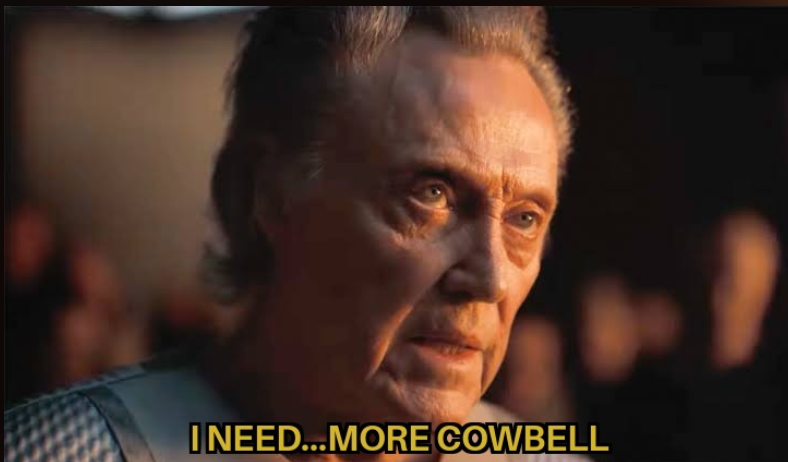

## mooR cowbell

<p align="center">
  
</p>

[mooR](https://timbran.org/moor.html) is a from-scratch rewrite of the LambdaMOO server in Rust,
designed for building persistent, programmable social environments. It's a multi-user virtual
environment where users can build and program the world around them while they're in it.

Cowbell is a from-scratch "core" database for mooR - the starter objects and code that provide the
foundation for building social spaces. It's designed specifically for use with mooR's bundled
[web client](https://codeberg.org/timbran/moor/src/branch/main/web-client), a rich web
application that connects to mooR server.

While taking inspiration from classic MOOs and TinyMU* systems, cowbell is built to
leverage the capabilities of contemporary web browsers or mobile devices rather than line-based `telnet`
like old-school MUDs.

### Vision

With the ongoing crisis and "enshittification" of commercial social media, we think people
crave alternatives - platforms that prioritize community, creativity, and user ownership over
engagement metrics and ad revenue.

Cowbell aims to be a toolkit for building rich, social experiences that can compete with commercial
messaging platforms (Discord, Slack, Instagram, Facebook Messenger) while preserving MOO's creative,
text-first culture. The goal: interaction quality matching contemporary messaging apps combined with
MOO's whimsical, creative spirit and user empowerment. Colourful, dynamic interfaces that still
fundamentally centre text, story, and social connection.

While the initial focus is on social interaction, the architecture is designed to support MUD/game/RPG
mechanics as well - combat systems, quests, skill checks, inventory management. These can be built on
top of the event and behaviour systems without requiring framework changes.

**Core principles:**

- **Web-first**: Rich content (HTML, Djot markdown, structured data) as first-class citizens
- **Event-driven**: Semantic narrative events with perspective rendering, not dumb string output
- **Language features**: Leverages mooR's lexical scopes, symbols, booleans, list comprehensions,
  maps, and flyweights
- **Composable**: Building blocks that work together without requiring code for common patterns
- **Accessible**: Text-first design that works naturally with screen readers and keyboard navigation
- **Version-controlled**: Objdef format enables proper source control; in-MOO changes merge back to
  repo

### Current Implementation Status

**Event System:**

- Event architecture with perspective rendering (`event.moo`, `event_receiver.moo`)
- Substitution system for perspective-dependent text (`sub.moo`, `sub_utils.moo`)
- Message bag system for randomized responses (`msg_bag.moo`)
- Pronoun system with customizable pronouns (`pronouns.moo`)

**Rich Content & Formatting:**

- HTML rendering system (`html.moo`)
- ANSI color codes (`ansi.moo`)
- Format objects: block, list, table, title, code (`format*.moo`)
- Rich look descriptions with structured content (`look.moo`, `examination.moo`)
- Support for multiple content types (text/plain, text/html, text/djot)

**Core Objects:**

- `$player` with multi-connection support, inventory, pronouns (`player.moo`)
- `$room` with event broadcasting, enterfunc/exitfunc (`room.moo`)
- `$thing` basic object prototype (`thing.moo`)
- `$actor` base for animated entities/NPCs (`actor.moo`)
- `$area` and `$passage` for spatial organization / exits, with route finding (`area.moo`, `passage.moo`)
- Prototype objects for primitives: `$str_proto`, `$list_proto`, `$int_proto`
- Type introspection: `$verb`, `$property`

**Item Prototypes:**

- `$container` for objects that hold other objects
- `$wearable` for clothing and worn items
- `$sittable` for furniture with seat limits and occupancy tracking (inspired by the one in JHCore)
- `$note` for readable/writable text objects

**Systems:**

- Authentication with argon2 password hashing (`password.moo`, `login.moo`)
- Capability-based security for fine-grained permissions (`root.moo`, `grant_utils.moo`, `@grant`)
- Object matching system (`match.moo`)
- Permission roles: arch_wizard, wizard, builder, programmer, hacker
- Relational/graph system for object relationships (`relation.moo`, `dvar.moo`)
- Rule engine for datalog-style queries and logic (`rule_engine.moo`, `rule.moo`)
- Reaction system for declarative event-driven behaviors (`reaction.moo`)
- Task scheduler for deferred and periodic execution (`scheduler.moo`)
- Help system with topic-based documentation (`help.moo`, `help_topics.moo`)

**Commands (via feature objects):**

- Social: `say`, `emote`, `whisper`, `who`, gestures (nod, wave, bow, bonk, etc.)
- Building: `@create`, `@recycle`, `@build`, `@dig`, `@rename`, `@describe`, `@move`, `@integrate`
- Messages: `@messages`, `@set-message`, `@get-message`, `@add-message`, `@del-message`
- Rules: `@rules`, `@set-rule`, `@show-rule`, `@clear-rule`
- Reactions: `@reactions`, `@add-reaction`, `@enable-reaction`, `@disable-reaction`
- Introspection: `@parent`, `@parents`, `@children`, `@audit`
- Programming: `eval`, `@list`, `@edit`, `@browse`, `@verb`, `@rmverb`, `@verbs`, `@property`, `@rmproperty`,
  `@properties`, `@args`, `@show`, `@chmod`, `@grep`, `@codepaste`, `@doc`
- Wizard: `@announce`, `@programmer`, `@builder`

**LLM Integration:**

- `$llm_client` - OpenAI-compatible API client for language models
- `$llm_agent` - Agent framework with tool support
- `$llm_room_observer` - NPCs that observe and respond to room events
- `$llm_wearable` - Wearable items with LLM capabilities
- Example agents: `Mr. Welcome` (concierge), `Data Visor` (code explorer), `Architect's Compass` (building assistant)

**World Content:**

- Starting area with connected rooms (`first_area.moo`, `first_room.moo`)
- Henri the cat - interactive NPC demonstrating rules, reactions, and message bags
- Example furniture (couch), containers (kibble cupboard), and items (brass key)

**Still Developing:**

- Additional builder commands for in-world editing
- More help topics and documentation coverage
- Asynchronous messaging system (letters, mailboxes, bulletin boards)

(Note: This is a from-scratch implementation. While some concepts are inspired by LambdaCore/JHCore,
we're not porting existing code wholesale - we're building idiomatically for mooR's advanced
features.)

### A Rich-Event-Driven Story for the user

LambdaCore and friends use `:tell("Ryan nods.")` or `notify(player, "Bob says, \"Hello\"")` - dumb string dumping with
no
context about what's happening. The client can't make smart rendering decisions. The objects in the environment can't
do anything with that.

Cowbell is designed to work with mooR's web client, which can understand and render structured events.
Instead of plain strings, the core sends **structured narrative events with metadata:**

```moo
// Create event with semantic information
event = $event:mk_say(player, "Hello everyone");

// Event is a flyweight containing:
// - Semantic slots (actor, timestamp, event type)
// - Template content with substitution flyweights
// - Delegate for behaviour ($event)

// Events transform themselves per viewer for perspective
// "You say" vs "Bob says", pronouns, etc.
for recipient in (room.contents)
  recipient:tell(event);  // Renders "you" or "Bob" as appropriate
endfor

// Web client receives both rendered content AND metadata
// Metadata enables smart rendering, and can do things like
// - 'say events → speech bubbles
// - 'emote events → italicized styling
// - 'whisper events → private styling
// - 'room_action events → ambient styling
// - Screenreaders or other accessibility tools provide better output or context 
```

The web client uses this to provide:

- **Rich rendering**: Speech bubbles for dialogue, emphasis for emotes, colour coding, images, avatars
- **Perspective rendering**: Same event shows different text to different viewers
- **Accessibility**: Screen readers get semantic context (this is speech, this is an action, this is a system message),
  not just raw text. Structured events provide navigation landmarks and allow users to filter by event type. Content
  type negotiation means users can request plain text, semantic HTML with ARIA labels, or other formats that work best
  for their assistive technology.
- **Extensibility**: New event types work without client changes (graceful degradation)
- **Rich content**: Events can carry HTML, Djot (like markdown), structured data

### Capability-Based Security

MOO's permission model relies on flag checking and ownership. Cowbell adds **capability
passing** for fine-grained, delegatable permissions:

```moo
// Issue a capability that grants specific operations
setup_cap = $root:issue_capability(new_player, {
  'set_player_flag,
  'set_name_aliases,
  'set_password,
  'move
});

// Capability can be passed to trusted code
// Recipient can only perform allowed operations
setup_cap:set_password("secret");  // Works
setup_cap:chparent(other_obj);     // Fails - not in capability list
```

This allows passing limited authority to code without transferring full ownership. Capabilities can be
revoked without changing object ownership, making it possible to grant temporary or conditional access.
You can audit which code has which capabilities, and follow the principle of least privilege by granting
only the specific operations needed rather than broad permissions.

### The Substitution System

The substitution system (`$sub`, `$sub_utils`) provides template-based text that automatically adapts
based on perspective (first-person vs third-person) and grammatical context. This is how events render
differently for different viewers.

**Basic concept:**

```moo
content = {$sub:nc(), " picks up ", $sub:d(), "."};
event = $event:mk_emote(player, @content):with_dobj(sword);
room:announce(event);

// To the actor: "You pick up the sword."
// To others: "Alice picks up the sword."
```

**Name substitutions:**

| Token          | Description     | Actor sees      | Others see   |
|----------------|-----------------|-----------------|--------------|
| `{n}` / `{nc}` | Actor name      | "you" / "You"   | "Alice"      |
| `{d}` / `{dc}` | Direct object   | "you" (if self) | "the sword"  |
| `{i}` / `{ic}` | Indirect object | "you" (if self) | "the chest"  |
| `{l}` / `{lc}` | Location        | "here"          | "the tavern" |

**Pronoun substitutions:**

| Token | Type            | Example (he/him)       | Example (they/them)       |
|-------|-----------------|------------------------|---------------------------|
| `{s}` | Subject         | "he" / "you"           | "they" / "you"            |
| `{o}` | Object          | "him" / "you"          | "them" / "you"            |
| `{p}` | Possessive adj  | "his" / "your"         | "their" / "your"          |
| `{q}` | Possessive noun | "his" / "yours"        | "theirs" / "yours"        |
| `{r}` | Reflexive       | "himself" / "yourself" | "themselves" / "yourself" |

Add `_dobj` or `_iobj` suffix for object pronouns: `{s_dobj}`, `{p_iobj}`, etc.

**Verb conjugation:**

| Token    | 2nd person | 3rd person |
|----------|------------|------------|
| `{be}`   | "are"      | "is"       |
| `{have}` | "have"     | "has"      |
| `{look}` | "look"     | "looks"    |

**Self-alternation** - different text for actor vs observers:

```moo
content = {$sub:nc(), " ", $sub:self_alt("feel", "feels"), " tired."};
// Actor: "You feel tired."
// Others: "Alice feels tired."
```

**Template compilation** (`$sub_utils`) parses human-readable templates:

```moo
template = "{nc} heads {the direction}.";
content = $sub_utils:compile(template);
// Returns list of flyweights ready for event content
```

**Articles:**

```moo
"{a sword}"     // "a sword" or "an ornate sword"
"{the direction}"  // "the north" (skips article for proper nouns)
"{The dc}"      // "The Sword" (capitalized article and noun)
```

### The Rule Engine

The rule engine (`$rule_engine`, `$rule`) provides a datalog-style query system for logic-based
conditions. Rules define predicates with goals that get evaluated against object properties.

**Use cases:**

- Access control ("can player X unlock door Y?")
- State queries ("is this object locked?")
- Relationship checks ("is player member of guild?")

**Rule syntax:**

Rules are written in a builder-friendly DSL:

```
Variable predicate?
Variable predicate(arg)?
Variable1 predicate1? AND Variable2 predicate2?
Variable1 predicate1? OR Variable2 predicate2?
NOT Variable predicate?
```

- **Capitalized names** are variables: `Key`, `Accessor`, `This`
- **Lowercase names** are constants: `player`, `this`, `location`
- **Quoted strings** match objects by name: `"golden key"`
- **Object literals**: `#123` or `#0000AB-12345678`

**Common patterns via @set-rule:**

```
@set-rule chest.lock_rule Key is("golden key")?
@set-rule chest.take_rule NOT This is_locked()?
@set-rule door.can_pass Accessor has_permission("vip")?
@set-rule vault.open_rule Accessor is_wizard? OR Key is("master key")?
```

**Predicates** call `fact_*` verbs on objects:

- `This is_locked()?` calls `this:fact_is_locked()`
- `Key is("golden key")?` calls `#0:fact_is(key, "golden key")`
- `Container contains(Item)?` calls `container:fact_contains(item)`

**Unification** finds variable bindings:

```
Child parent(Parent)? AND Parent parent(Grandparent)?
```

With `Child` bound to an object, this finds Parent and Grandparent through transitive resolution.

**Creating custom predicates:**

```moo
verb fact_has_key (this none this)
  {accessor, required_key} = args;
  return required_key in accessor.contents;
endverb
```

Then use: `Accessor has_key("rusty key")?`

### The Reaction System

The reaction system (`$reaction`) provides declarative event-driven behaviors. Instead of writing
complex verb code, builders specify triggers, conditions, and effects.

**Use cases:**

- Interactive objects (doors that unlock, containers that react to items)
- Environmental responses (objects changing state based on actions)
- Simple NPC behaviors (react to being petted, talked to, etc.)

**Anatomy of a reaction:**

1. **Trigger** - the event that initiates the check (`'on_pet`, `'on_unlock`, or threshold)
2. **When clause** - optional condition using rule engine syntax (use `0` for no condition)
3. **Effects** - list of actions to perform

**Adding reactions via @add-reaction:**

```
@add-reaction OBJECT.NAME_reaction TRIGGER WHEN EFFECTS
```

Examples:

```
@add-reaction chest.unlock_reaction 'on_unlock 0 {{'set, 'locked, false}}
@add-reaction chest.open_reaction 'on_open 0 {{'emote, "creaks open."}}
@add-reaction cat.pet_reaction 'on_pet "NOT This is_grouchy?" {{'emote, "purrs."}}
```

**Available triggers:**

- `'on_get`, `'on_drop`, `'on_take`, `'on_put`
- `'on_open`, `'on_close`, `'on_lock`, `'on_unlock`
- `'on_enter`, `'on_leave`, `'on_pet`
- `'on_wear`, `'on_remove`, `'on_use`
- `'on_sit`, `'on_stand`

**Threshold triggers** fire when a property crosses a value:

```
@add-reaction cat.warmup_reaction {'when, 'pets_received, 'ge, 10} 0 {{'set, 'mood, "happy"}}
```

Comparison operators: `'eq`, `'ne`, `'gt`, `'lt`, `'ge`, `'le`

**Effect types:**

| Effect       | Syntax                          | Description                    |
|--------------|---------------------------------|--------------------------------|
| `'set`       | `{'set, 'prop, value}`          | Set property to value          |
| `'increment` | `{'increment, 'prop, ?amount}`  | Add to numeric property        |
| `'decrement` | `{'decrement, 'prop, ?amount}`  | Subtract from property         |
| `'announce`  | `{'announce, "template"}`       | Broadcast to location          |
| `'emote`     | `{'emote, "template"}`          | Object emotes in location      |
| `'tell`      | `{'tell, 'RecipientVar, "msg"}` | Private message                |
| `'move`      | `{'move, destination}`          | Move object                    |
| `'trigger`   | `{'trigger, target, 'event}`    | Fire event on another object   |
| `'delay`     | `{'delay, seconds, effect}`     | Schedule effect for later      |
| `'action`    | `{'action, 'verb_name, target}` | Call `action_<verb>` on target |

**Message templates** use `$sub_utils` syntax:

- `{nc}` - Capitalized actor name
- `{d}`, `{i}` - Direct/indirect object names
- `{s}`, `{o}`, `{p}` - Subject/object/possessive pronouns

```
@add-reaction door.unlock_reaction 'on_unlock 0 {{'announce, "{nc} unlocks {i}."}}
```

**Message property references** - use symbols to reference properties:

```
@set-message cat.pet_msg "purrs contentedly."
@add-reaction cat.pet_reaction 'on_pet 0 {{'emote, 'pet_msg}}
```

**Random messages** - if the property is a `$msg_bag`, a random message is picked each time:

```
@add-message cat.pet_msgs "purrs contentedly."
@add-message cat.pet_msgs "rubs against {p} legs."
@add-reaction cat.pet_reaction 'on_pet 0 {{'emote, 'pet_msgs}}
```

**Managing reactions:**

```
@reactions <object>              # List all reactions on object
@enable-reaction obj.name_reaction
@disable-reaction obj.name_reaction
```

**Action effects** invoke behaviors on other objects:

```
@add-reaction henri.sit_reaction 'on_cupboard_open 0 {{'action, 'sit, couch}}
```

This calls `couch:action_sit(henri, context)`. Objects define their own action handlers
(e.g., `$sittable` defines `action_sit` and `action_stand`).

**Programmatic creation** - for more complex cases:

```moo
reaction = $reaction:mk('on_unlock, "Key is(\"brass key\")?", {
  {'announce, "{nc} hears a click."},
  {'set, 'locked, false}
});
chest.unlock_reaction = reaction;
```

**Firing triggers from verb code:**

```moo
this:fire_trigger('on_unlock, ['Actor -> player, 'Key -> key_obj]);
```

See the kibble cupboard (`kibble_cupboard.moo`) for a complete example of lockable/openable behavior
configured entirely through rules and reactions.

## Development

To compile / validate your changes use the provided `Makefile`

- `make` will use the latest mooR release (via docker) to compiler / import "*.moo" into a local
  generated old-style textdump file, for the purpose of validation
- `make clean` will destroy said file
- `make gen.objdir` will build a new objdef dir from the local changes.
- `make rebuild` will build a new objdef dir with your local changes and then (WARNING) _overwrite_
  your local changes. Think of this is as a formatting step (for prior to commit, etc)

To run cowbell with moor, clone it into the moor repository (there's a `clone-cowbell.sh` script
in `cores/` to help with this). Then from the moor repository root:

```bash
rm -rf moor-data && MOOR_CORE=cores/cowbell/src npm run full:dev
```

This clears any existing database and starts fresh with the cowbell core.

## Contribution

Cowbell is in early days - workflows and conventions haven't been fully refined for external
contributions yet. That said, we're happy to help and educate if you're interested in contributing.
Come chat with us on [Discord](https://discord.gg/Ec94y5983z) to discuss ideas and get guidance.

## Design Goals & Roadmap

The goal is to build a toolkit that enables:

1. **Social Experience**: Interaction quality matching contemporary messaging platforms while
   preserving MOO's creative, text-first culture
2. **Composable Building**: Pre-made behaviours (lockable, openable, container) that work without
   writing code
3. **Rich Authoring Tools**: Both traditional MOO commands and web-based editors
4. **Mobile-Friendly**: Touch interactions, gesture-based navigation, responsive layouts
5. **Accessible by Default**: Screen reader support, keyboard navigation, semantic HTML, customizable
   presentation

**Key planned features:**

- **Rich event vocabulary**: Social events (say, emote, whisper, hug, wave), environmental events
  (arrive, depart, look), system events (inventory, who, errors), and game events (combat, quests)
- **Multi-connection support**: Multiple simultaneous connections per player (phone + laptop, different
  views/layouts per connection)
- **Composable behaviours**: Mix-and-match traits (lockable, openable, container, wearable, etc.) to
  build objects without code
- **Web UI patterns**: Speech bubbles for dialogue, verb palettes for actions, rich room/object cards,
  mobile-friendly touch interactions
- **Presentation system**: Server-triggered UI panels (object browser, verb editor, property editor,
  room builder)
- **Template library**: Pre-configured objects (doors, containers, furniture) for rapid building

**Long-term vision**: A platform where:

- New users can build rich, interactive spaces without programming
- Experienced builders can rapidly prototype with pre-made behaviours
- The web client competes with Discord, Slack, and Instagram for interaction quality
- Mobile users have a first-class experience
- Everyone can participate regardless of ability
